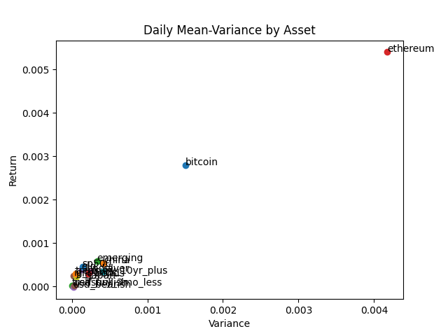

# Portfolio Optimization using Modern Portfolio Theory

This analysis is to demonstrate simple portfolio analysis and explore my own conjectures. For the simpler analysis, I used a set of only 16 assets, as a starter set. The more advanced analysis explores a broader universe without the normal distribution assumption and exploits market regimes. I was inspired to run this analysis after taking Investment Science (CFRM 501) in the University of Washington Computational Finance Program, taught by Professor Tim Leung, in Fall 2019.

#### Fixed Income
| Asset | Symbol|
| - | - |
| U.S. Treasury debt for 3 months or shorter term | BIL |
| U.S. Treasury debt for 10 years or longer term | BLV |
| Junk U.S. bonds | HYG |
| Investment Grade U.S. bonds | LQD |

#### Equities
| Asset | Symbol|
| - | - |
| S&P 500 | SPY |
| Japan | EWJ |
| U.K. | EWU |
| Emerging Markets | EEM |
| China | GXC |
| India | INDY |

#### Alternatives
| Asset | Symbol|
| - | - |
| Bitcoin | BTC-USD |
| Ethereum | ETH-USD |
| Gold | GLD |
| Silver | SlV |

#### Currencies
| Asset | Symbol|
| - | - |
| USD Bearish against six G10 currency basket, trade-weighted | UDN |
| USD Bullish against same | UUP |

### Individual Mean-Variance Plots
###### The second plot zooms in, as the crypto assets are extreme on the first plot.

### Individual Asset Ranking
| Asset | Sharpe Ratio |
| - | - |
| usd_bearish | -0.066 |
| usd_bullish | 0.076 |
| japan | 0.197 |
| silver | 0.273 |
| uk | 0.32 |
| india | 0.348 |
| china | 0.412 |
| junk bonds | 0.497 |
| emerging | 0.506 |
| gold | 0.529 |
| sp500 | 0.615 |
| treasury 10yr plus |0.659 |
| ig bonds | 0.733 |
| bitcoin | 1.145 |
| treasury_3mo_less | 1.17 |
| ethereum | 1.328 |

### Discussion
Due to their extreme returns and volatility, I didn't know whether Bitcoin and Ethereum would have a high Sharpe ratio, as Sharpe Ratio penalizes volatility. However, both assets were in the top 3. I expected the short-term Treasury debt to have a low Sharpe Ratio because of its extremely low return, but it was 2nd highest. This is because the asset has such low volatility that the Sharpe Ratio became much higher. The USD bearish ETF was the only asset with a negative Sharpe Ratio, which is because it had negative mean returns over its history.

### Asset Combination Mean-Variance Plots
###### The red point highlights the portfolio with maximum Sharpe Ratio

### Asset Combination with Maximum Sharpe Ratio Statistics
| 2-Asset  ||
| - | - |
| Asset Names | bitcoin, treasury_3mo_less |
| Weights | 0.148%, 99.852%                |
| Daily Variance | 2.758e-08               |
| Daily Return | 4.123e-05                 |
| Annual Sharpe Ratio | 3.941              |
  
| 3-Asset | |
| - | - |
| Asset Names | bitcoin, ethereum, treasury_3mo_less |
| Weights | 0.101%, 0.055%, 99.844%                  |
| Daily Variance | 2.891e-08                         |
| Daily Return | 4.338e-05                           |
| Annual Sharpe Ratio | 4.05                         |
  
| All Asset | |
| - | - |
| Asset Names | bitcoin, china, emerging, ethereum, gld, ig_bonds, india, japan, jnk_bonds, silver, sp500, treasury_10yr_plus, treasury_3mo_less, uk, usd_bearish, usd_bullish |
| Weights | 0.091%, 0.000%, 0.000%, 0.051%, 0.113%, 0.054%, 0.000%, 0.000%, 0.000%, 0.000%, 0.216%, 0.275%, 98.978%, 0.000%, 0.000%, 0.222% |
| Daily Variance | 2.967e-08  |
| Daily Return | 4.489e-05   |
| Annual Sharpe Ratio | 4.137 |

### Discussion
I expected the short-term Treasury debt to be in the optimized portfolio, but I didn't expect it to be consistently >98% weight for the best combinations. The crypto currencies offest the variance of the treasury 3 month the most; as other weights are below 1% in all portfolios, it's unreasonable to conjecture further. As it's been proven, the maximum Sharpe Ratio increases if you increase diversification.

### Advanced Analysis, TODO

### Data

Adjusted close price is used for each asset. The date range is from the earliest date to 4/9/21 inclusive. Data source is Yahoo Finance

### References

[Sharpe Ratio](https://www.investopedia.com/articles/07/sharpe_ratio.asp)
